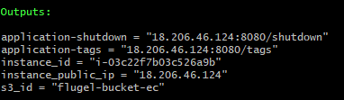
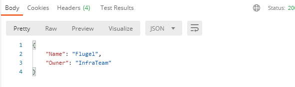
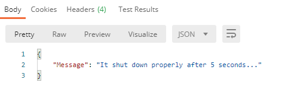

# Flugel test

## Table of contents
* [General info](#general-info)
* [Tasks](#tasks)
* [Technologies](#technologies)
* [Test](#test)
* [Run](#run)

## General info
This project responds to the test sent by Flugel. It is recommended to perform the test first

## Tasks
* Create Terraform code to create an S3 bucket and an EC2 instance. Both resources must be tagged with Name=Flugel,Owner=InfraTeam.
* Using Terratest, create the test automation for the Terraform code, validating that both resources are tagged properly.
* In the EC2 instance, run a simple HTTP service written in Python with two endpoints:
    * /tags: must display EC2 instance tags.
    * /shutdown: must shutdown the instance.
* Setup Github Actions to run a pipeline to validate this code.
* Publish your code in a public GitHub repository, and share a Pull Request with your code. Do not merge into master until the PR is approved.
* Include documentation describing the steps to run and test the automation.

## Technologies
Project is created with:
* Python 3.8.5 >=
* Flask 2.0.1 >=
* Terraform 1.0.7 >=
	
## Test
To run test for this project, I made a script that allows to speed up the assignment of environment variables:

```
$ test.sh <access_key_aws> <secret_key_aws>
```

## Run
There are 2 ways to run this project


Enter the following directory

```
$ cd aws
```

Then, you run this command

```
$ terraform init
```
### 1st way

If you did the test, then run the terraform commands without parameters:


```
$ terraform apply
```
At the end of execution, the following output variables will be presented



These variables allow you to test the functionality of each microservice,
Wait a few minutes while the microservice is installed and running.

#### Response application-tags 



#### Response application-shutdown 




### 2nd way

If you did not do the test, you must send the commands in this way

```
$ terraform apply -var "access_key=XXXXXXXXXXXXXXXX" -var "secret_key=XXXXXXXXXXXXXXXXXXXXXXXXXXXXXXXXXX"
```

### Destroy

To destroy all objects, just send this command

```
$ terraform destroy
```